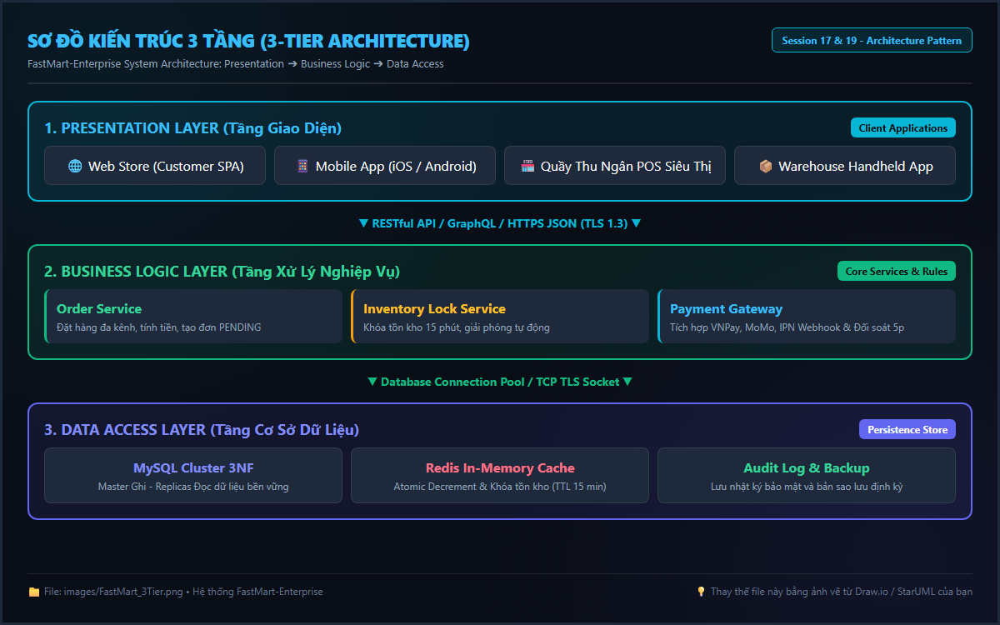
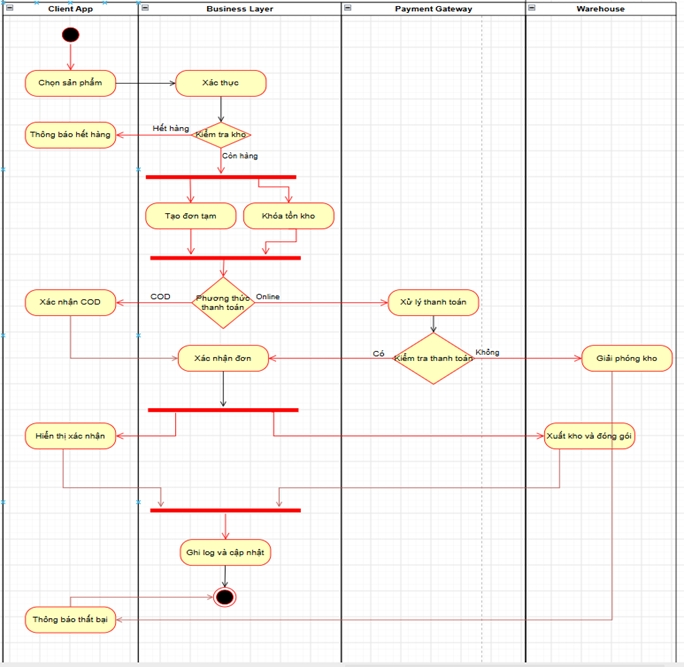
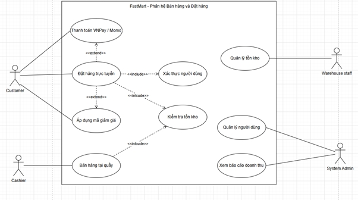
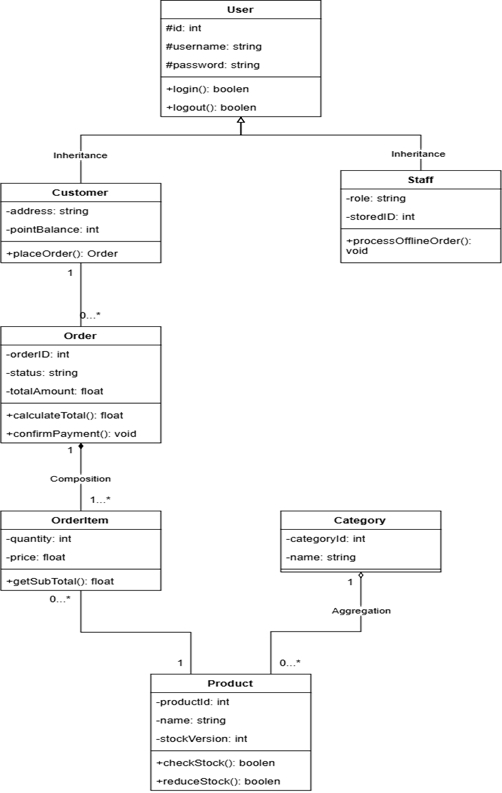
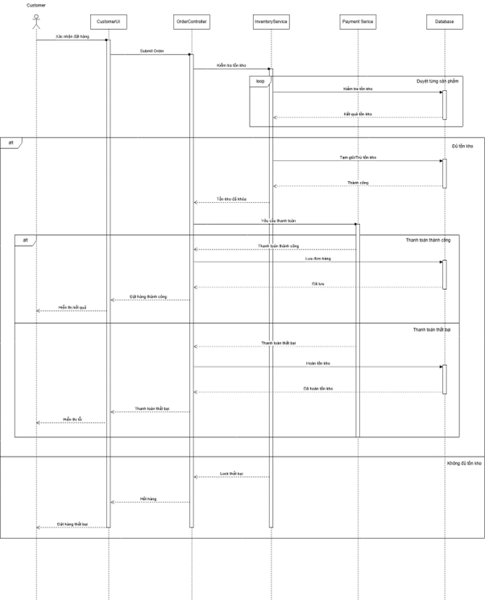
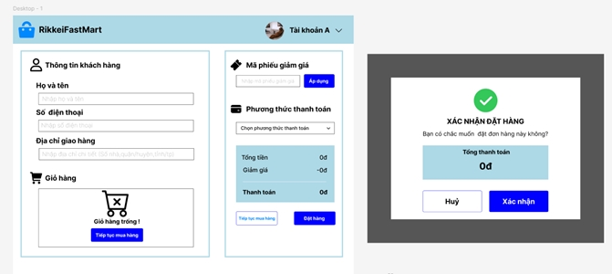
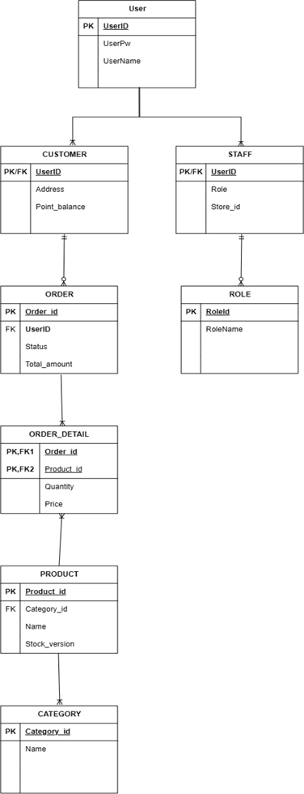

Tài liệu đặc tả Hệ thống Quản lý Chuỗi Bán lẻ & Đặt hàng Đa kênh FastMart-Enterprise

## I. Giới thiệu chung

1. Mục đích của tài liệu

Tài liệu này giúp sinh viên:

Nắm bắt tư duy phân tích và thiết kế hệ thống phần mềm quản lý chuỗi bán lẻ đa kênh ở cấp độ doanh nghiệp (Enterprise) từ góc nhìn System Analyst (SA).

Vận dụng tổng hợp toàn bộ kiến thức và kỹ năng từ Session 01 đến Session 18:

Phân tích hệ thống thông tin, phân loại HTTT, quy trình SDLC và mô hình kiến trúc 3 tầng (3-Tier Architecture: Presentation, Business Logic, Data Access).

Thu thập, khảo sát yêu cầu, ma trận Stakeholders, phân loại yêu cầu chức năng (FR) / phi chức năng (NFR), viết User Story.

Mô hình hóa quy trình nghiệp vụ bằng Activity Diagram rẽ nhánh có làn công việc (Swimlanes).

Xác định Actor, xây dựng Use Case Diagram (chứa quan hệ <<include>>, <<extend>>) và đặc tả Use Case chi tiết (Use Case Specification).

Thiết kế cấu trúc tĩnh bằng Class Diagram 3 ngăn (Access Modifiers, Multiplicity, Inheritance, Aggregation/Composition).

Mô hình hóa luồng tương tác thời gian thực bằng Sequence Diagram (Lifelines, Messages, Activation Bar, Combined Fragments: alt, loop, opt).

Thiết kế phác thảo Giao diện Người dùng (UI/UX Wireframe/Mockup) từ Use Cases.

Thiết kế sơ đồ Cơ sở dữ liệu ERD đạt chuẩn 3NF (1NF, 2NF, 3NF) từ Class Diagram.

Đóng gói Hồ sơ Đặc tả Yêu cầu Phần mềm (SRS - Software Requirements Specification) hoàn chỉnh theo tiêu chuẩn quốc tế IEEE 830 / ISO 29148.

Phạm vi áp dụng: Mini Project tổng hợp cuối khóa (Session 19), làm việc và bảo vệ theo nhóm.

2. Phạm vi hệ thống

Bài toán: Xây dựng hệ thống quản lý chuỗi bán lẻ và đặt hàng đa kênh FastMart-Enterprise (FastMart-GSP) hỗ trợ 50 siêu thị thành viên và nền tảng bán hàng trực tuyến (Mobile App & Website).

Đối tượng sử dụng: Khách hàng trực tuyến, Thu ngân POS tại siêu thị, Nhân viên kho, Quản trị viên hệ thống (System Admin), Ban Giám đốc & Quản lý chuỗi.

Giới hạn hệ thống: Tập trung vào các phân hệ cốt lõi: Đặt hàng đa kênh, Khóa tồn kho thời gian thực, Thanh toán tích hợp VNPAY/MOMOPAY, Quản lý kho & Giao hàng, Quản lý danh mục sản phẩm, Báo cáo doanh thu & Vận hành. Không bao gồm các hệ thống tài chính kế toán chuyên sâu ERP hay sản xuất trực tiếp.

Mô hình kiến trúc: Chuyển đổi từ nền tảng Monolithic (1-Tier) cũ sang mô hình Kiến trúc 3 tầng (3-Tier Architecture) phân tách độc lập giữa Presentation, Business Logic và Data Access.

## II. Mô tả tổng quan

1. Bối cảnh sử dụng

FastMart hiện đang vận hành 50 siêu thị FMCG và nền tảng bán hàng trực tuyến trên hệ thống phần mềm Monolithic cũ với nhiều bất cập lớn:

Khi diễn ra Flash Sale hoặc giờ cao điểm, lượng truy cập tăng vọt gây nghẽn mạng, tràn CSDL, dẫn đến sập hệ thống và đứt gãy thanh toán.

Dữ liệu tồn kho giữa cửa hàng và nền tảng online không đồng bộ theo thời gian thực, dẫn đến tình trạng Khách đặt hàng thành công nhưng kho đã hết hàng (Over-selling).

Dữ liệu và tài liệu thiết kế cũ rời rạc, không chuẩn hóa, gây tranh chấp phạm vi và khó khăn cho đội ngũ Lập trình (Dev) và Kiểm thử (Tester).

Ban Giám đốc quyết định đầu tư phân tích, thiết kế lại hệ thống FastMart-Enterprise đạt chuẩn SRS chuyên nghiệp.

2. Chức năng chính

Hệ thống bao gồm 7 phân hệ chức năng chính:

1. Quản lý Đặt hàng Đa kênh (Omnichannel Ordering): Hỗ trợ đặt hàng qua Mobile App/Website và bán hàng trực tiếp tại quầy POS.

2. Khóa Tồn kho Thời gian thực (Real-time Inventory Lock): Tự động kiểm tra và khóa hàng tồn kho khi khách tạo đơn hàng, chống bán quá số lượng.

3. Thanh toán & Tích hợp Cổng thanh toán (Payment Integration): Hỗ trợ Tiền mặt, Chuyển khoản, Ví điện tử (VNPay/Momo) và đối soát giao dịch tự động.

4. Tiếp nhận & Xử lý Đơn hàng Kho (Warehouse Order Processing): Xử lý đóng gói, xuất kho và bàn giao cho đơn vị vận chuyển.

5. Quản lý Danh mục & Sản phẩm (Product Catalog Management): Quản lý loại sản phẩm, đơn giá, hình ảnh, khuyến mãi.

6. Báo cáo Thống kê & Doanh thu (Analytics & Reporting): Thống kê doanh thu theo kênh, hiệu suất kho, tồn kho cảnh báo.

7. Quản trị Hệ thống & Phân quyền (System Admin & Security): Quản lý tài khoản, phân quyền truy cập 3-tier và log giao dịch.

## III. Đặc tả dữ liệu

1. Người dùng (User / Customer / Staff)

| Thuộc tính | Kiểu dữ liệu | Mô tả | Ràng buộc |
| --- | --- | --- | --- |
| userId | String | Mã người dùng | Duy nhất, tự sinh (VD: US-0001) |
| username | String | Tên đăng nhập | Bắt buộc, duy nhất, 6-30 ký tự |
| password | String | Mật khẩu | Bắt buộc, mã hóa SHA-256/BCrypt |
| fullName | String | Họ và tên | Bắt buộc |
| phone | String | Số điện thoại | Bắt buộc, 10 chữ số, bắt đầu bằng '0' |
| email | String | Email | Định dạng Email chuẩn, duy nhất |
| role | String | Vai trò | CUSTOMER / CASHIER / WAREHOUSE / ADMIN |

2. Sản phẩm (Product)

| Thuộc tính | Kiểu dữ liệu | Mô tả | Ràng buộc |
| --- | --- | --- | --- |
| productId | String | Mã sản phẩm | Duy nhất, tự sinh (VD: PRD-1001) |
| productName | String | Tên sản phẩm | Bắt buộc, không rỗng |
| categoryId | String | Mã danh mục | Bắt buộc, tham chiếu Category |
| unitPrice | Double | Đơn giá bán (VNĐ) | Bắt buộc, > 0 |
| stockQuantity | Integer | Số lượng tồn kho | Bắt buộc, >= 0 |
| status | String | Trạng thái | ACTIVE / INACTIVE |

3. Đơn hàng (Order)

| Thuộc tính | Kiểu dữ liệu | Mô tả | Ràng buộc |
| --- | --- | --- | --- |
| orderId | String | Mã đơn hàng | Duy nhất, tự sinh (VD: ORD-8801) |
| customerId | String | Mã khách hàng | Bắt buộc, tham chiếu User |
| orderDate | DateTime | Ngày giờ đặt | Tự động = thời gian hiện tại |
| totalAmount | Double | Tổng giá trị đơn | Tự động tính từ các OrderItem |
| channel | String | Kênh đặt hàng | ONLINE_WEB / ONLINE_APP / POS_COUNTER |
| status | String | Trạng thái đơn | PENDING / CONFIRMED / PROCESSING / SHIPPED / COMPLETED / CANCELLED |

4. Chi tiết Đơn hàng (OrderItem)

| Thuộc tính | Kiểu dữ liệu | Mô tả | Ràng buộc |
| --- | --- | --- | --- |
| orderId | String | Mã đơn hàng | Bắt buộc, tham chiếu Order |
| productId | String | Mã sản phẩm | Bắt buộc, tham chiếu Product |
| quantity | Integer | Số lượng đặt | Bắt buộc, >= 1 |
| price | Double | Đơn giá tại thời điểm | Bắt buộc, > 0 |
| lineTotal | Double | Thành tiền | Tự tính = quantity * price |

5. Thanh toán (Payment)

| Thuộc tính | Kiểu dữ liệu | Mô tả | Ràng buộc |
| --- | --- | --- | --- |
| paymentId | String | Mã thanh toán | Duy nhất, tự sinh (VD: PAY-9001) |
| orderId | String | Mã đơn hàng | Bắt buộc, tham chiếu Order |
| paymentMethod | String | Phương thức | CASH / BANK_TRANSFER / VNPAY / MOMO |
| amount | Double | Số tiền thanh toán | Bắt buộc, = Order.totalAmount |
| paymentStatus | String | Trạng thái | UNPAID / PAID / FAILED / REFUNDED |
| transactionNo | String | Mã giao dịch cổng | Lưu mã giao dịch Cổng nếu có |

## IV. Yêu cầu nghiệp vụ và Vận dụng kỹ thuật

| STT | Nghiệp vụ | Mô tả chi tiết | Kiến thức / Vận dụng |
| --- | --- | --- | --- |
| 1 | Phân tích Kiến trúc 3 tầng (3-Tier Architecture) | Phân tách hệ thống thành 3 tầng: Presentation Layer, Business Logic Layer, Data Access Layer. Giải thích cơ chế chống nghẽn mạng và lộ CSDL. | Session 17: Kiến trúc hệ thống 3 tầng |
| 2 | Lập Ma trận Stakeholders & User Stories | Lập Ma trận Nhu cầu tra cứu SRS cho 4 nhóm (Ban Giám đốc, PM, Dev, Tester). Viết User Stories dạng As a... I want... So that... | Session 03 & 17: Stakeholders, User Story, SRS |
| 3 | Phân loại Yêu cầu Chức năng & Phi chức năng | Định nghĩa các FR (Đặt hàng, Trừ tồn kho, Thanh toán) và NFR (SLA Uptime 99.9%, Latency < 2s, SSL/TLS, 10,000 CCU) chuẩn SMART. | Session 03 & 17: FR/NFR, Tiêu chuẩn SMART |
| 4 | Activity Diagram luồng Đặt hàng Đa kênh | Vẽ sơ đồ Activity Diagram có Swimlanes rẽ nhánh chia 4 làn: Khách hàng, Business Layer, Cổng Thanh toán, Hệ thống Kho. Thể hiện Decision Node. | Session 04: Activity Diagram rẽ nhánh & Swimlanes |
| 5 | Use Case Diagram & Đặc tả Use Case "Đặt hàng" | Vẽ Use Case Diagram chứa <<include>> (Xác thực, Kiểm tra tồn kho) và <<extend>> (Áp Voucher, Thanh toán VNPAY). Viết đặc tả Use Case chi tiết. | Session 04: Use Case Diagram & Đặc tả Use Case |
| 6 | Trích xuất Class Diagram 3 ngăn chi tiết | Xây dựng Class Diagram cho phân hệ Đặt hàng & Sản phẩm. Thể hiện đủ 3 ngăn, các mối quan hệ Inheritance, Aggregation/Composition, Bội số. | Session 07: Class Diagram 3 ngăn, OOP, Quan hệ & Bội số |
| 7 | Sequence Diagram luồng Đặt hàng & Trừ Tồn kho | Vẽ Sequence Diagram tương tác thời gian thực giữa CustomerUI, OrderController, InventoryService, PaymentService, Database. Dùng alt, loop. | Session 09: Sequence Diagram, Lifelines, Combined Fragments |
| 8 | Thiết kế Phác thảo UI/UX Wireframe Checkout | Dựng Wireframe màn hình Giỏ hàng & Thanh toán (Checkout Page) hiển thị đủ Input fields, Dropdown, Table sản phẩm, Modal xác nhận. | Session 13: Thiết kế UI/UX, Wireframe/Mockup |
| 9 | Thiết kế Cơ sở Dữ liệu ERD đạt chuẩn 3NF | Mapping Class Diagram sang ERD. Xác định PK, FK, Mối quan hệ. Thực hiện chuẩn hóa dữ liệu 3NF (xóa lặp 1NF, phụ thuộc 2NF/3NF - tách OrderDetail). | Session 15: Thiết kế ERD, Mapping Class -> ERD, 3NF |
| 10 | Đóng gói Hồ sơ SRS IEEE 830 / ISO 29148 | Tổng hợp đóng gói hồ sơ SRS đạt chuẩn international gồm: Trang bìa, Lịch sử thay đổi (v1.0 APPROVED), Cấu trúc 4 phần, Bảng ký duyệt 3 bên. | Session 17 & 18: Đóng gói tài liệu SRS chuẩn IEEE 830 |

### Danh mục Bản vẽ Sơ đồ Kỹ thuật (Thư mục images/)

#### 1. Sơ đồ Kiến trúc 3 tầng (3-Tier Architecture)

#### 2. Sơ đồ Activity Diagram 4 làn Swimlanes (Quy trình Đặt hàng & Khóa tồn kho)

#### 3. Sơ đồ Use Case Diagram & Mối quan hệ <<include>>, <<extend>>

#### 4. Sơ đồ Class Diagram 3 ngăn chi tiết & Quan hệ OOP

#### 5. Sơ đồ Sequence Diagram Xác nhận Đặt hàng & Trừ tồn kho thời gian thực

#### 6. Sơ đồ Phác thảo Giao diện UI/UX Wireframe Màn hình Checkout

#### 7. Sơ đồ Cơ sở Dữ liệu ERD Đạt Chuẩn 3NF (1NF ➔ 2NF ➔ 3NF)

## V. Ràng buộc nghiệp vụ và Bẫy dữ liệu (Edge Cases)

1. Validation (Xác thực dữ liệu đầu vào)

Số điện thoại người dùng phải gồm 10 chữ số, bắt đầu bằng chữ số 0.

Số lượng đặt sản phẩm (quantity) phải là số nguyên dương strictly (> 0).

Đơn giá sản phẩm (unitPrice) phải lớn hơn 0.

Mã giảm giá (Voucher) phải được kiểm tra thời hạn sử dụng và số lượng lượt dùng còn lại trước khi áp dụng.

2. Business Rules (Quy tắc nghiệp vụ)

Trừ tồn kho thời gian thực: Ngay khi Khách hàng nhấn 'Đặt hàng', hệ thống phải thực hiện Khóa tạm thời (Hold Stock) lượng hàng trong kho trong 15 phút. Nếu quá 15 phút không thanh toán, hệ thống tự động giải phóng tồn kho.

Tạo hóa đơn: Hóa đơn/Đơn hàng chỉ chuyển sang trạng thái CONFIRMED sau khi nhận được xác nhận thanh toán thành công.

3. Xử lý Bẫy dữ liệu dị biệt (Edge Cases)

Bẫy 1 - Tranh chấp Tồn kho đồng thời (Race Condition): Khi nhiều người dùng đặt mua sản phẩm cuối cùng tại cùng 1 millisecond (Flash Sale), Business Logic Layer áp dụng khóa Optimistic/Pessimistic Locking để đảm bảo chỉ 1 đơn thành công, không xảy ra Over-selling.

Bẫy 2 - Gián đoạn Cổng Thanh toán (Payment Callback Timeout): Khách bị trừ tiền trên Ví nhưng đứt kết nối mạng nên Callback không gửi về hệ thống FastMart. Hệ thống thiết kế luồng Sequence & Exception Flow với dịch vụ Reconciliation (Đối soát tự động) sau 5 phút.

Bẫy 3 - Dữ liệu Giao dịch Dị biệt (Negative/Invalid Input Injection): Khách hàng hoặc Hacker gửi số lượng âm (quantity = -5) hoặc mã Voucher giả mạo. Tầng Business Logic thực hiện Defensive Validation, chặn lập tức và trả về mã lỗi 400 Bad Request kèm log.

4. Permission (Phân quyền 3-Tier)

| Chức năng | Khách hàng | Thu ngân POS | Thủ kho | System Admin |
| --- | --- | --- | --- | --- |
| Xem danh mục & Tìm kiếm SP | Xem | Xem | Xem | Toàn quyền |
| Đặt hàng trực tuyến (Online) | Tạo/Xem đơn mình | Không | Không | Xem |
| Bán hàng & In hóa đơn POS | Không | Toàn quyền | Không | Xem |
| Tiếp nhận, Đóng gói & Xuất kho | Không | Không | Toàn quyền | Xem |
| Quản lý Danh mục & Đơn giá | Không | Không | Không | Toàn quyền |
| Phân quyền & Xem Báo cáo | Không | Không | Không | Toàn quyền |

## VI. Kết quả mong đợi

Sau khi hoàn thành bài Mini Project Session 19, sinh viên sẽ bàn giao một Hồ sơ Đặc tả Yêu cầu Phần mềm (SRS) hoàn chỉnh cho hệ thống FastMart-Enterprise đáp ứng:

Chất lượng Hồ sơ SRS: Đạt chuẩn quốc tế IEEE 830 / ISO 29148 với đầy đủ Trang bìa, Lịch sử thay đổi (v1.0 APPROVED), Cấu trúc 4 phần chuẩn, Tiêu chuẩn trình bày SMART và Bảng ký duyệt 3 bên.

Tính Thống nhất & Truy vết (Traceability): Truy vết nhất quán 100% từ Bối cảnh 3-Tier → User Story → Activity Diagram → Use Case & Specification → Class Diagram 3 ngăn → Sequence Diagram → UI Wireframe → ERD 3NF.

Tư duy Chống lỗi (Defensive Design): Thiết kế giải pháp xử lý triệt để 3 Bẫy dữ liệu dị biệt (Race Condition tồn kho, Callback Timeout thanh toán, Negative Input Injection).

Sẵn sàng Phát triển: Hồ sơ SRS làm căn cứ chuẩn mực để bàn giao trực tiếp cho Đội Lập trình (Dev) xây dựng code và Đội Kiểm thử (Tester) viết Test Cases nghiệm thu.
